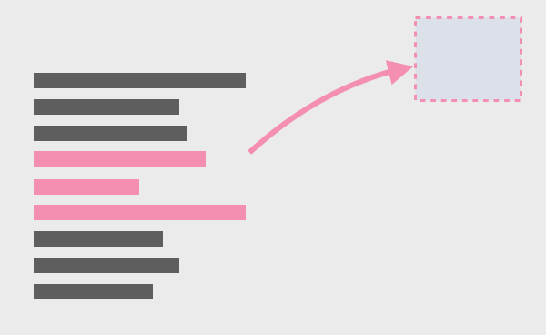

# 함수 추출하기 (Extract Function)

하나의 독립된 논리로 분리할 수 있는 코드 덩어리를 찾아서 별도의 함수로 분리하여 목적을 더 선명하게 드러내는 기법.



## 🗣 설명

### 🧐 As is

```js
function printOwing(invoice) {
  printBanner();
  let outstanding = calculateOutstanding();
  console.log("고객명: ${invoice.customer}");
  console.log("채무액: ${outstanding}");
}
```

### 😍 To be

```js
function printOwing(invoice) {
  printBanner();
  const outstanding = calculateOutstanding();
  printDetails(outstanding);
}

function printDetails(outstanding) {
  console.log("고객명: ${invoice.customer}");
  console.log("채무액: ${outstanding}");
}
```

### 📋 상세

하나의 독립된 논리로 분리할 수 있는 코드 덩어리를 찾아서 별도의 함수로 분리하고 목적을 드러내는 이름을 할당한다. 함수가 지나치게 길거나 함수의 논리가 복잡해서 코드가 하는 일을 쉽게 이해하기가 어려운 문제를 해결할 때 사용할 수 있는 기법이다. 함수가 복잡하지 않아도 의도를 더 분명하게 드러내기 위해서 함수 추출하기를 사용할 수도 있다.

### ⚙️ 절차

1. 함수를 새로 만들어서 함수의 목적을 설명하는 이름을 함수에 붙여 준다.
2. 추출할 코드를 원본 함수에서 복사해서 새 함수에 붙여 넣는다.
3. 추출한 코드 중 원본 함수의 지역 변수를 참조하거나 추출한 함수의 유효범위를 벗어나는 변수가 있다면 매개변수로 전달한다.
4. 원본 함수에서 추출한 코드를 새로 만든 함수를 호출하는 문장으로 바꾼다.
5. 테스트한다.
6. 다른 코드에 방금 추출한 것과 똑같거나 비슷한 코드가 없는지 살핀다.

## 📝 메모
